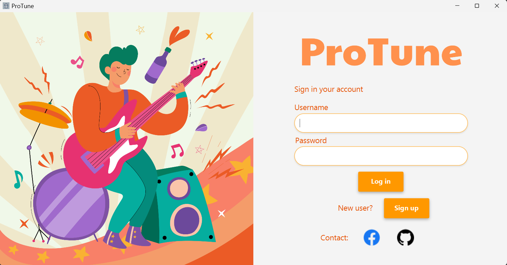
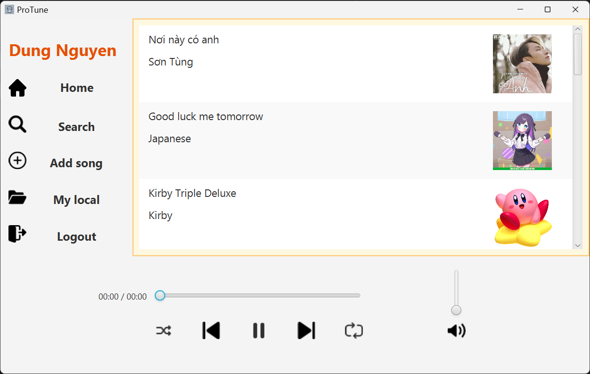
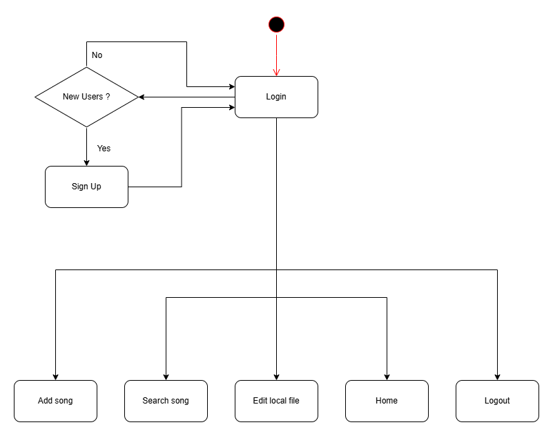

# [ProTune]

[Mô tả dự án]

Dạo gần đây, nhu cầu quản lý thư viện nhạc cá nhân ngày càng tăng. Để giúp người dùng có trải nghiệm tốt hơn khi nghe nhạc, tôi xây dựng **ProTune** – một ứng dụng nghe nhạc đơn giản nhưng mạnh mẽ.

**ProTune** giúp người dùng tìm kiếm bài hát, phát nhạc với giao diện trực quan và hỗ trợ nhiều định dạng nhạc khác nhau. Ứng dụng cũng tích hợp các tính năng như phát nhạc nền, lưu trữ dữ liệu một cách tiện lợi.

Với **ProTune**, việc nghe nhạc trở nên dễ dàng và thú vị hơn bao giờ hết! 🚀🎶

## Authors

- [@DungNguyenCoder]([https://www.github.com/octokatherine](https://github.com/DungNguyenCoder))


## Demo

https://youtu.be/GQ8ZjGvNvhA


## Screenshots





## Features

🎧 Phát nhạc: Nghe nhạc từ thư viện cá nhân, và công khai

🔍 Tìm kiếm bài hát: Tìm nhanh bài hát theo tên hoặc nghệ sĩ

🎨 Giao diện thân thiện: Thiết kế đơn giản, dễ sử dụng

💾 Lưu trữ và quản lý dữ liệu: Hỗ trợ lưu bài hát và thông tin người dùng

## File structure

css
```
ProTune/
│── src/
│   ├── main/
│   │   ├── java/dungnguyen.protunefinal/
│   │   │   ├── controllers/
│   │   │   │   ├── AddController.java
│   │   │   │   ├── ControlController.java
│   │   │   │   ├── HomeController.java
│   │   │   │   ├── LocalController.java
│   │   │   │   ├── LoginController.java
│   │   │   │   ├── MainController.java
│   │   │   │   ├── SearchController.java
│   │   │   │   ├── SignupController.java
│   │   │   │   
│   │   │   ├── models/
│   │   │   │   ├── SongData.java
│   │   │   │   ├── UserData.java
│   │   │   │   
│   │   │   ├── utilz/
│   │   │   │   ├── Constants.java
│   │   │   │   ├── LoadSave.java
│   │   │   │   ├── OpenLink.java
│   │   │   │   ├── ShowAlert.java
│   │   │   │   ├── SongListCell.java
│   │   │   │   
│   │   │   ├── MainApp.java
│   │   │   
│   │   ├── resources/dungnguyen.protunefinal/
│   │   │   ├── images/
│   │   │   │   ├── icons/
│   │   │   │   ├── img/
│   │   │   │   ├── logos/
│   │   │   │   
│   │   │   ├── views.fxml/
│   │   │   │   ├── add.css
│   │   │   │   ├── add.fxml
│   │   │   │   ├── control-view.css
│   │   │   │   ├── control-view.fxml
│   │   │   │   ├── home.css
│   │   │   │   ├── home.fxml
│   │   │   │   ├── local.css
│   │   │   │   ├── local.fxml
│   │   │   │   ├── login-view.css
│   │   │   │   ├── login-view.fxml
│   │   │   │   ├── main-view.fxml
│   │   │   │   ├── search.css
│   │   │   │   ├── search.fxml
│   │   │   │   ├── signup-view.css
│   │   │   │   ├── signup-view.fxml   
```

## Requirements

- Java 23.0.2
- Maven 4.0.0
- JavaFX 23.0.2

## Diagram UML




## Installation

Cách cài đặt dự án

```bash
  - Clone dự án
  - Mở terminal và chạy lệnh: mvn clean install
  - Chạy ứng dụng

  - Down file jar từ ...
  - Chạy file jar
```
